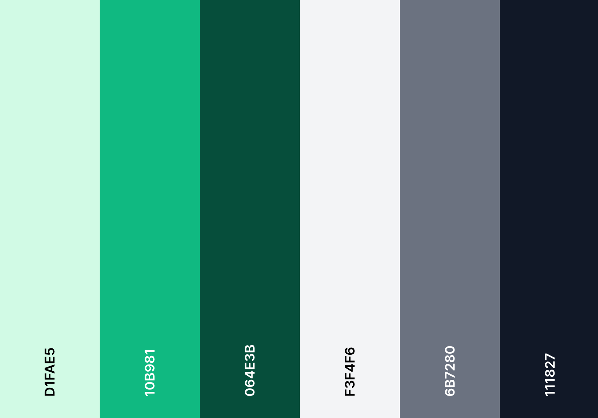

# Portfolio

Minimalistic and fully responsive portfolio website inspired from Seán Halpin's design. Beautifully crafted with subtle yet elegant animations that bring the UI to life.
<br />

<div style="display: flex; justify-content: start; align-items: center; column-gap: 20px">
    
    
    
    
    
</div>


Powered by [NextJS 13](https://nextjs.org/), [React 18](https://react.dev), [Typescript 5](https://www.typescriptlang.org), [Tailwind CSS 3](https://tailwindcss.com), [Framer Motion](https://www.framer.com/motion/)

<hr />

## This section is for developers only

## Getting Started

First, run the development server:

```bash
npm run dev
# or
yarn dev
# or
pnpm dev
```

Open [http://localhost:3000](http://localhost:3000) with your browser to see the result.

This project uses [`next/font`](https://nextjs.org/docs/basic-features/font-optimization) to automatically optimize and 
load ***Inter*** and ***Sacramento***, a custom Google Font.


## Colour Palette


